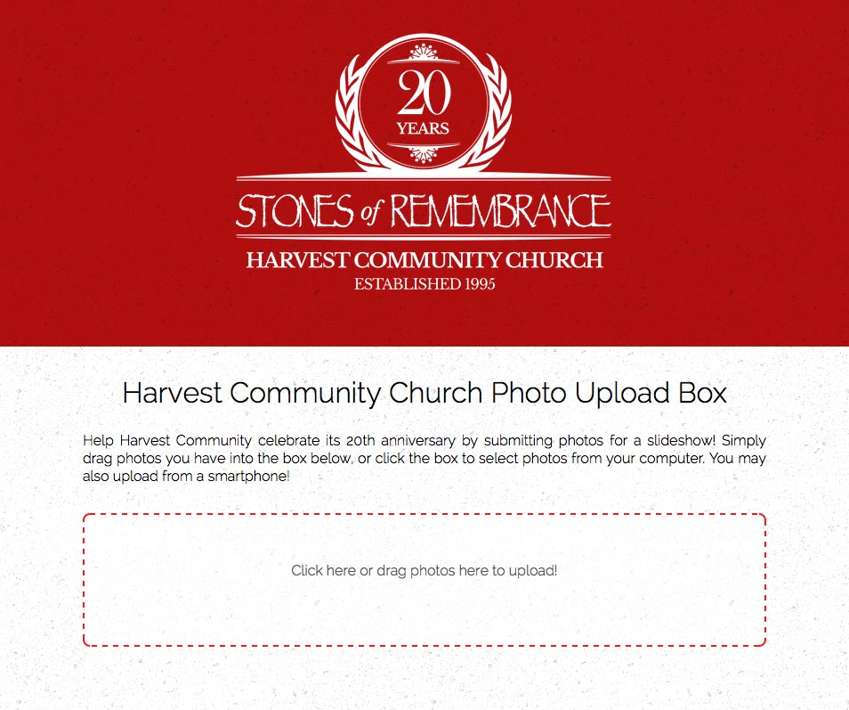

hcc-photo-upload
================

A simple photo dropbox for members of Harvest Community Church to submit photos
they have taken in the past



About
-----

This website allows people to drag-and-drop pictures into a dropbox. The photos
are then aggregated in a Google Drive folder for easy download.

This project is built with the [Pyramid](http://www.pylonsproject.org/)
framework and [Dropzone.js](http://www.dropzonejs.com/).
[Docker](https://www.docker.com/) is not required to run the project, but is
highly recommended.

Creating a Google Drive project
-------------------------------

This project uses the Google Drive REST API and requires an Oauth Client ID and
secret from Google. Follow the directions in the [Google Developer
Documentation](https://developers.google.com/drive/web/auth/web-server#create_a_client_id_and_client_secret)
to generate them:

1. Go to the [Google Developers Console]
(https://console.developers.google.com/)
2. Select a project, or create a new one.
3. In the sidebar on the left, expand **APIs & auth**. Next, click **APIs**.
Select the **Enabled APIs** link in the API section to see a list of all your
enabled APIs. Make sure that the Drive API is on the list of enabled APIs. If
you have not enabled it, select the API from the list of APIs, then select the
**Enable API** button for the API.
4. In the sidebar on the left, select **Credentials**. Click **Create new
Client ID** under the **OAuth** heading to create your OAuth 2.0 credentials.

The Client ID type should be "Web Application." Note the redirect URI chosen
(e.g. http://server.com/oauth2callback), as it is needed when starting the
server.

Running with Docker
-------------------

To build the Docker container, run `docker build -t "hcc/hcc-photo-upload"
docker/` from the root of this repository. To start the container, run the
following:

```
docker run -d \
    -v /srv/hcc-photos:/srv/hcc-photo-upload/data \
    -e GOOGLE_CLIENT_ID="xxxxx.apps.googleusercontent.com" \
    -e GOOGLE_CLIENT_SECRET="xxxxx" \
    -e GOOGLE_TARGET_FOLDERNAME="HCC 20th Anniversary Photos" \
    -e OAUTH_CALLBACK_PATH="/oauth2callback" \
    hcc/hcc-photo-upload
```

Replace `GOOGLE_CLIENT_ID` and `GOOGLE_CLIENT_SECRET` with the appropriate
values. Replace `OAUTH_CALLBACK_PATH` with the proper path (i.e. the Redirect
URI entered in the Google Developer Console, minus the protocol and host). This
will bind-mount the data directory (containing the sqlite database and uploaded
photos that have not yet been transferred to Google Drive) on `/srv/hcc-photos`
on the host, and will upload pictures into the "HCC 20th Anniversary Photos"
folder on Google Drive.
